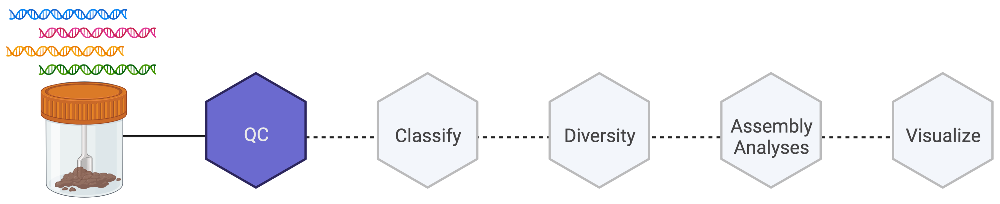

# Metagenome quality control

Week 2 goals are to understand the tools and steps involved in quality control for metagenomic short reads.




## Trimmomatic Manuscript (10-20 Minutes)

[Trimmomatic](https://pubmed.ncbi.nlm.nih.gov/24695404/) is a widely used tool for preprocessing reads. Let's read the manuscript and touch on some points that stand out.


## Trim Those Reads (35-45 Minutes)

### Download PM06 Reads

[PM06S](https://emory-my.sharepoint.com/:u:/g/personal/mwoodwo_emory_edu/Efw2c9seTzVAgpeM8smB4HMBZI9REQ1spmZUbKlRvoVpew?e=RS43cp) is a file that contains contatenated raw reads. To get this file on the server, you will need to:

- download the file to your local computer
- upload from your computer to the server
  - with an ssh GUI client like [cyberduck](https://cyberduck.io)
  - via commandline with scp or [rsync](https://www.tecmint.com/rsync-local-remote-file-synchronization-commands/):
  
  ``` console
  rsync -avzhe ssh --progress ${localpath} ${username}@${EMORYServerIPAddress}:${serverpath}
  ```

### Decompress Reads

``` console
tar -xf PM06S.tar.gz
```


### Sequencing by synthesis

[Illumina short-read high-throughput multiplexed sequencing](https://www.google.com/url?sa=t&rct=j&q=&esrc=s&source=web&cd=&cad=rja&uact=8&ved=2ahUKEwjXkJyQyvT8AhUWmIkEHYlsArsQtwJ6BAgKEAI&url=https%3A%2F%2Fwww.youtube.com%2Fwatch%3Fv%3DfCd6B5HRaZ8&usg=AOvVaw0qqyiPhh-rg-gJvFyHWMf8) is the most widely used sequencing approach.

This approach requires post-processing steps prior to analysis. When paired-end reads come off the flow cell as fastq data files from multiple flow cell lanes, they need to be concatenated as forward and reverse read files (R1/R2).


### Run Trimmomatic

*Make sure you have installed conda, created a trimmomatic environment, and installed trimmomatic first!*

- if trimmomatic was installed with conda, you may need to specify the path of illumina adaptor sequences, which are also on github:

```console
# download trimmomatic repository
git clone https://github.com/timflutre/trimmomatic

# adapters are then found in trimmomatic/adapters
adapter_path=

# add this directory to your path so they are easy to locate
export PATH="$PATH:${adapter_path}"
```

- create a directory to save trimmomatic summary output files:

```console
${outdir}/summary_files
```

- trimmomatic can then be run:

``` console
# set values for variables in generalized code
ID=PM6-S
indir=
outdir=

# set values for R1 and R2
R1=${indir}/${ID}_R1.fastq
R2=${indir}/${ID}_R2.fastq

# run trimmomatic
trimmomatic PE -threads 10 -phred33 -summary ${outdir}/summary_files/${ID}_summary.txt $R1 $R2 ${outdir}/${ID}_P1.fastq ${outdir}/${ID}_U1.fastq ${outdir}/${ID}_P2.fastq ${outdir}/${ID}_U2.fastq ILLUMINACLIP:TruSeq3-PE.fa:2:30:10:2:keepBothReads LEADING:3 TRAILING:3 MINLEN:36
```

- unpaired reads can then be concatenated:

``` console
cat ${outdir}/${ID}_U1.fastq ${outdir}/${ID}_U2.fastq > ${outdir}/${ID}_U.fastq
```

- method to loop over list of files [OPTIONAL]

``` console
# set values for variables in generalized code
IDlist=${listdir}/IDlist.txt
indir=
outdir=

# with comma-delimited ID file SAMPLE,SRR_ACC
for line in `cat $IDlist`; do ID=$(echo $line | cut -d, -f1); echo starting $ID ...; R1=${indir}/${ID}/${ID}_1.fastq; R2=${indir}/${ID}/${ID}_2.fastq; trimmomatic PE -threads 10 -phred33 -summary ${outdir}/summary_files/${ID}_summary.txt $R1 $R2 ${outdir}/${ID}_P1.fastq ${outdir}/${ID}_U1.fastq ${outdir}/${ID}_P2.fastq ${outdir}/${ID}_U2.fastq ILLUMINACLIP:TruSeq3-PE.fa:2:30:10:2:keepBothReads LEADING:3 TRAILING:3 MINLEN:36; echo $ID seems complete ...; echo ''; done
```

## Other Quality Control Steps

- FastQC
- Decontamination of host reads with bowtie2 or BMTagger


## Kneaddata for trimmomatic and host read removal

The biobakery tool [kneaddata](https://huttenhower.sph.harvard.edu/kneaddata) is a wrapper pipeline that will accept reads and run trimmomatic and host read removal with bowtie2 as the default.

- *Ensure Java SE (replacement for java runtime environment) is installed - IT IS ALREADY ON OUR SERVER*
``` console
wget https://download.oracle.com/java/19/latest/jdk-19_linux-x64_bin.tar.gz
```

Follow instructions for installaion [here](https://docs.oracle.com/en/java/javase/19/install/installation-jdk-linux-platforms.html#GUID-ADC9C14A-5F51-4C32-802C-9639A947317F)

- create a new conda environment
``` console
conda create --name kneaddata
```

- install pip
``` console
conda install pip
```

- install kneaddata
``` console
pip install kneaddata
```

- create directory to save host reference genome (index)
``` console
# as an example, i have a software directory and created a sub-directory for kneaddata_databases
DIR=/home/${netid}/software/kneaddata_databases
```

- download human genome reference
``` console
kneaddata_database --download human_genome bowtie2 $DIR
```

- run kneaddata
  - Input: Illumina paired end read fastq files (e.g. PM06S_R1.fastq, PMO6S_R2.fastq)
  - Output: Trimmed files depleted of human-genome aligning reads (${ID}_paired_1.fastq, ${ID}_paired_2.fastq, ${ID}_unmatched_1.fastq, ${ID}_unmatched_2.fastq), human-aligning reads, and a log file.


```console
# Define variables
indir=${path_to_read_files}
outdir=${path_for_kneaddata_output}
R1=${indir}/${ID}_R1.fastq  # <- double check naming convention
R2=${indir}/${ID}_R2.fastq  # <- double check naming convention
db=${path_to_reference_human_genome}

args="-db $db --output-prefix $ID -t 8 --remove-intermediate-output --trimmomatic /storage/home/hcoda1/0/mwoodworth8/.conda/envs/biobakery/share/trimmomatic-0.39-1"
    # note: arguments are saved here for brevity of command below.
    #       i have had errors in the past that resolved with specifying the full
    #       path for trimmomatic, you may not need that argument for the latest version.
```

```console
kneaddata -i $R1 -i $R2 -o $outdir $args
```

- Examine/clean output

---

## Week 3 prep (5 minutes)

Next week, we will work on short read taxonomic classification using kraken2 and bracken. A [(relatively) recent benchmarking study](https://www.sciencedirect.com/science/article/pii/S0092867419307755) supports the use of kraken2/bracken workflows for short read classification. To prepare for next week, let's:

- Read the [kraken2](https://pubmed.ncbi.nlm.nih.gov/31779668/) and [bracken](https://peerj.com/articles/cs-104/) papers
- create environments for kraken2 and bracken
- download the small version of the latest kraken2 database
- classify your trimmed metagenome reads from trimmomatic from week 2 from PM06
- [OPTIONAL] you may want to also look at [this recent paper from the kraken group](https://www.nature.com/articles/s41596-022-00738-y).
