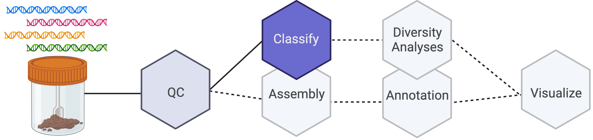

# Short Read Taxonomic Classification

Week 3 goals are to understand the tools and steps involved in taxonomic classification of metagenomic short reads.




## 1. kraken2 Manuscript

[kraken2](https://pubmed.ncbi.nlm.nih.gov/31779668/) is tool that uses a k-mer based approach to assign a taxonomic classification to sequencing reads. Classification estimates can be refined with the bayesian tool [bracken](https://peerj.com/articles/cs-104/). 

---

## 2. Classify Reads

Most of the following steps are abstracted from the [kraken2 manual](https://github.com/DerrickWood/kraken2/blob/master/docs/MANUAL.markdown), which should be considered the primary source for questions/troubleshooting.

### Download kraken2 database

The first step after downloading kraken2 with conda is to download or build a kraken2 database. We will work with pre-built databases. *(Note: If you install bracken with conda (e.g. conda install bracken), it should also install kraken2)* 

**A major advantage of working with a pre-built database is we can skip all of the steps in the kraken2/bracken manuals that describe building databases.**

The kraken2 database gets updated every few months to reflect new taxa, new reference sequences, and updated taxonomic nomenclature (sigh). At time of writing this GitHub page, the pre-built databases were moved to an amazon server with this [public-facing site](https://benlangmead.github.io/aws-indexes/k2). 

On this site, note there are a number of different pre-built databases that you can download and setup depending on your data and research questions. For our purposes, to try to minimize our disk usage on this server and to demonstrate the steps, we will work with the standard-8 database, which is a version that is limited to <8gb. If you want to convince yourself of whether the taxa in this limited database will be useful, you can view the results of the [database inspection output](https://genome-idx.s3.amazonaws.com/kraken/standard_08gb_20221209/inspect.txt).

The kraken2 manual includes details for how to download publicly-available data to build your own database or add custom sequences of interest to your database but these are beyond our scope.

``` console
# recommended to download to a directory that indicates the size and version, I am using:
/home/${netID}/software/kraken2-db/8gb_230206

# download most recent 8gb database at time of GitHub commit
wget https://genome-idx.s3.amazonaws.com/kraken/k2_standard_08gb_20221209.tar.gz
```
``` console
# decompress database
tar -xf k2_standard_08gb_20221209.tar.gz
```

### Run kraken2

Once we have downloaded a pre-built database, we can initialize our variables and run kraken2.

*Note: There are multiple output options for kraken2 but bracken requires the default report format from kraken2 (which we have labeled with the .kreport suffix in our command below).*

``` console
indir=${path_to_preprocessed_reads} # either trimmomatic or human read decontamination output directory
outdir=${path_to_kraken2_report}
ID=PM6-S
db=/home/${netID}/software/kraken2-db/8gb_230206
```

``` console
kraken2 --db $db --threads 20 --output ${outdir}/${ID}.kraken2 --report ${outdir}/${ID}.kreport --paired ${indir}/${ID}_P1.fastq ${indir}/${ID}_P2.fastq
```

We can also loop over a list of IDs to run kraken2 for several files.
``` console
IDlist=
for ID in `cat $IDlist`; do echo starting $ID ...; kraken2 --db $db --threads 20 --output ${ID}.kraken2 --report ${ID}.kreport --paired ${indir}/${ID}_P1.fastq ${indir}/${ID}_P2.fastq; echo $ID complete ...; echo ''; done
```

### Run bracken

After installing bracken with conda, initialize variables and run bracken.

``` console
indir=${path_to_kraken2_report}
outdir=${path_to_bracken_output}
ID=PM6-S
db=/home/${netID}/software/kraken2-db/8gb_230206
kreport=${indir}/${ID}.kreport # specify path/name structure for kraken2 report
level=S   # specify taxonomic level to estimate
```

```console
bracken -d $db -i $kreport -o ${outdir}/${ID}_${level}.bracken -w ${outdir}/${ID}_${level}.kb -r 150 -l $level
```

We can also loop over a list of IDs to run bracken for several files.
``` console
IDlist=
for ID in `cat $IDlist`; do echo starting $ID ...; bracken -d $db -i $kreport -o ${outdir}/${ID}_${level}.bracken -w ${outdir}/${ID}_${level}.kb -r 100 -l $level; echo $ID complete ...; echo ''; done
```

### Summarize output
- Use combine_bracken_output.py to combine output files

The [authors of bracken also included a helper script](https://github.com/jenniferlu717/Bracken/blob/master/analysis_scripts/combine_bracken_outputs.py) to combine bracken output files for multiple files that can be useful for analysis. To run this script, you can download it and add the path to the script to your path.

```console
# recommended to create a directory to save custom scripts like:
/home/${netID}/software/scripts

# download script
cd ${scripts} # change into your scripts directory and download script
wget https://github.com/jenniferlu717/Bracken/blob/master/analysis_scripts/combine_bracken_outputs.py
```

```console
# add script to path
export PATH="$PATH:${scripts}"
```

Reinitialize variables to run combine_bracken_output.py:

```console
indir=${path_to_bracken_output}
outdir=${path_to_combined_bracken_output}
```

We can trim the suffix from the bracken output that notes the classification level prior to combining files by linking them to a new location. This creates a file link that doesn't use disk space (similar to a shortcut in Windows/OSX). 

``` console
cd $outdir
for f in ../*_S.bracken; do ID=$(echo $f | cut -d_ -f1 | cut -d/ -f2); ln -s $f ${ID}.bracken; done
```

The bracken combine_bracken_outputs.py script expects a comma-separated list of names and a space-separated list of files. These can be generated as arrays:

``` console
# run this command in directory with renamed file links to generate a report array
report_array=(`ls ${indir}/*.bracken`)

# check array contents
echo ${report_array[@]}
```

Comma-separated list of names can then be generated with cut:

``` console
bracken_names=(`ls *.bracken | cut -d. -f1`)

# check array contents
echo ${bracken_names[@]}
```

Initialize a function to change field separator:

``` console
# function to switch field separator
join_arr() {
  local IFS="$1"
  shift
  echo "$*"
}

# create new array by switching field separator of bracken_names array
names=(`join_arr , "${bracken_names[@]}"`)
```

Run combine_bracken_output.py

``` console
combine_bracken_output.py --files "${report_array[@]}" --names "${names[@]}" -o ${outdir}/combined_Bracken_S.tsv
```

- [kraken-biom](https://github.com/smdabdoub/kraken-biom)

This tool can convert a directory of kraken2 reports and summarizes them in biom format, which preserves the full taxonomy table for read classifications, which is useful for input into phyloseq and other tools that work with taxonomy tables.

``` console
# create new report_array of kraken-style report from bracken
report_array=(`ls ${indir}/*.kb`)

kraken-biom ${report_array[@]} --fmt json -o ${outdir}/mg_S-biom.json
```

### Expected output

After running the above code, we should have:
- a directory with kraken2 output and reports
- a directory with bracken reports
- a combined_Bracken_S.tsv file that contains output from all bracken output files
- an mg_S-biom.json file that contains output from all bracken output files in biom format

---

## Week 4 prep (5 minutes)

Next week, we will work on diversity metrics with taxonomy matrices. To prepare for next week, let's:

- Download PREMIX kraken2/bracken output files
- Review [Vegan](https://github.com/vegandevs/vegan) R package
- Review [Phyloseq](https://joey711.github.io/phyloseq/index.html) R package
